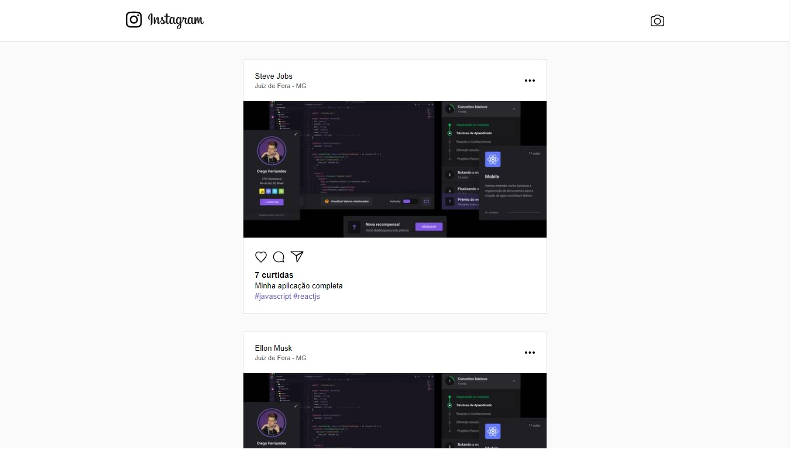
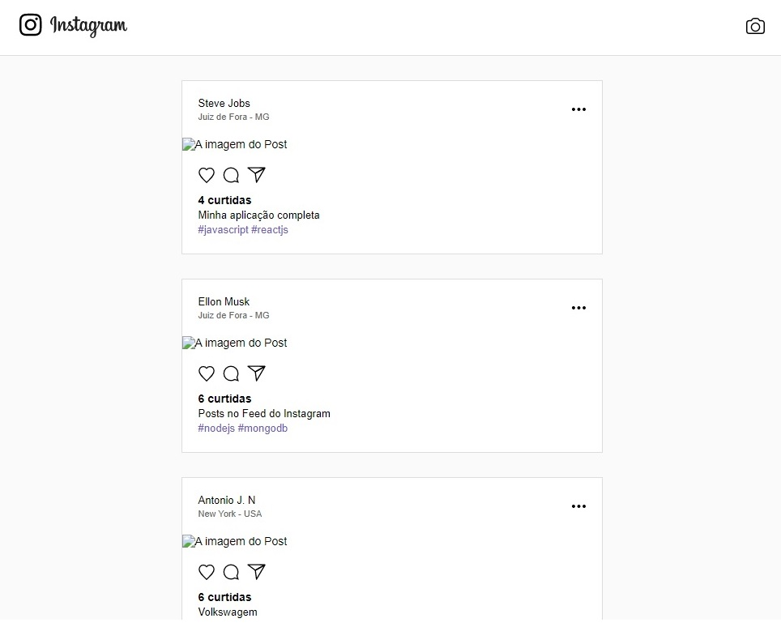
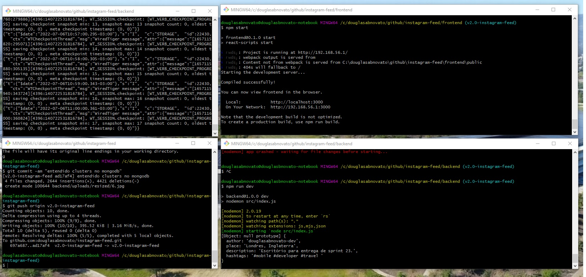
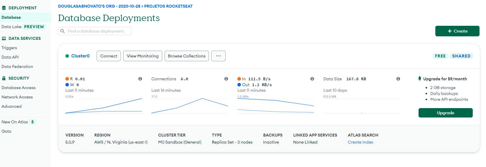

<h4 align="center"> 
	🚧 Instagram Feed 🚀
</h4> 

<p align="center">  
  <a href="https://www.twitter.com/douglasabnovato/">    
  
  </a>
</p>

## 💻 Sobre o projeto

♻️ Instagram Feed

A aplicação é o feed do Instagram com um frontend web, um frontend mobile e um backend.

- [x] Configuiração de ambiente
- [x] Construindo o backend
- [x] Construindo a interface a web
- [x] Desenvolver o app mobile: não evoluir esse módulo
- [ ] Criar funcionalidades avançadas 
- [ ] Hospedar a aplicação: frontend web e backend
 
## 🎨 Layout

🎨 Instagram Feed - Mobile


 
🎨 Instagram Feed - Web

<p align="center" style="display: flex; align-items: flex-start; justify-content: center;">
  
  
  
</p> 

## 🚧 Ambiente em Desenvolvimento

- As quatro telas do terminal gitbash rodando o mongodb rodando no backend, o servidor no backend e o frontend, e o git para registrar os commits conforme as tarefas são realizadas.

- O dashboard do mongodb atlas conforme os testes das funcionalidades da aplicação web demonstrando o consumo.

<p align="center" style="display: flex; align-items: flex-start; justify-content: center;">
  
  
</p> 

## 🚧 Construindo o projeto 

O objetivo é anotar informações que julguei importantes que aconteceram durante a construção do projeto.

#### Ambiente de desenvolvimento

- [x] 1.1. NodeJS - `https://nodejs.org/en/` : versão LTS: v12.18.3 - `node -v`;
- [x] 1.2. package manager - Chocolatey é para o ambiente windows
- [x] 1.3. gerenciador de pacotes 
- [x] 1.3.1. npm : `npm -v`
- [x] 1.3.2. Yarn : `https://yarnpkg.com/` : versão LTS: v1.21.1 - `yarn -v`
- [x] 1.4. Editor : VSCode 
- [x] 1.5. Extensões e Plugins
- [x] 1.5.1. Tema: `dracula`
- [x] 1.5.2. `rocketseat react native`
- [x] 1.5.3. `rocketseat reactjs`
- [x] 1.5.4. `Material icon theme`
- [x] 1.5.5. fonte `fira code`
- [x] 1.6. Sketch cloud - desenhar a aplicação : Instagram Feed

#### Criando a base de dados da aplicação - BACKEND 

- [x] 2.1. Empresas que estão utilizando essa tecnologia React, React Native, Nodejs: NetFlix, Trello, PayPal, Linkedin, Uber, NASA, Medium
- [x] 2.2. backend da aplicação utilizando nodejs
- [x] 2.3. api rest: serviços que não possuem funcionalidades de view
- [x] 2.4. nova pasta : backend - `yarn init -y` : cria arquivo `package.json` : guarda os registros das dependências do nosso projeto
- [x] 2.5. instalar dependência Express : `yarn add express`
- [x] 2.5.1. `yarn.lock`: arquivo de logs
- [x] 2.5.2. scripts : dev : `node src/index.js` >> `http://localhost:3333/` : PORTA DO backend
- [x] 2.5.3. Nodemon : `yarn add nodemon -D` - script dev no package.json - `yarn dev` : atualiza o servidor a cada mudança - `scripts : dev : nodemon src/index.js`
- [x] 2.5.4. rodar a aplicação: `yarn dev` ou `npm run dev`
- [x] 2.6.1. MongoDB Atlas - bd não relacional online: `https://www.mongodb.com/cloud/atlas`
- [x] 2.6.2. criar um cluster >> connect >> Your Application >> copy na string de acesso
- [x] 2.6.3. criar db access >> alterar informações na string de acesso
- [x] 2.6.4. criar network access >> add ip address
- [x] 2.7. mongoose : `yarn add mongoose`
- [x] 2.7.1. mongoose.connect no index.js
- [x] 2.8. Api Rest
- [x] 2.8.1. arquivo `routes.js`
- [x] 2.8.2. criar pastas : src : models, controllers, config
- [x] 2.9. Models
- [x] 2.9.1. Post.js
- [x] 2.10. Config
- [x] 2.10.1. upload.js
- [x] 2.11. Controllers 
- [x] 2.11.1. LikeController.js
- [x] 2.11.2. PostController.js
- [x] 2.12. Insomnia : Instalar e criar uma workspace
- [x] 2.13. Multer : `yarn add multer`
- [x] 2.13.1. path : biblioteca que formata caminho de arquivos
- [x] 2.13.2. upload de imagens no diretório do projeto - multer.diskStorage
- [x] 2.13.3. upload de imagem na base de dados
- [x] 2.13.4. listando os posts na api rest
- [x] 2.13.5. dar like : `http://localhost:3333/posts/5d03fa4f261c3d2928c817bb/like`
- [x] 2.13.6. redimensionar imagens: dimensões menores, qualidade menores.
- [x] 2.13.7. instalar sharp: manipular imagens dentro da aplicação - `yarn add sharp`
- [x] 2.13.8. insomnia - post >> create >> `http://localhost:3333/posts`
- [x] 2.13.9. deletar a imagem original : `fs.unlinkSync`
- [x] 2.13.10. path : endereço da imagem : `http://localhost:3333/files/OmniStack.png`
- [x] 2.13.11. transformando png em jpg - `http://localhost:3333/files/OmniStack.jpg`
- [x] 2.14. cors : `yarn add cors` : permitir acessibilidade mesmo em domínios diferentes
- [x] 2.15. real time : biblioteca **socket.io**  : `yarn add socket.io`
- [x] 2.15.1. `socket.io` : server = http e io demais : possibilitam acessar a aplicação de diferentes protocolos, ou seja, que nosso backend seja visualizado pelo frontend.
- [x] 2.16. Revisão:
- [x] 2.16.1. `index.js`:entrada da nossa aplicação- importação das dependências, conexão com banco de dados, divisão do servidor para http e socket.io, o cors permitindo acesso por todos protocolos, rotas para arquivos físicos e estáticos
- [x] 2.16.2. `routes.js`: rotas get e post, rotas para realizar likes
- [x] 2.16.3. controllers: LikeController e PostController fazendo nossa regra de negócios.
- [x] 2.16.4. Model Post: uma representação da tabela no banco de dados.
- [x] 2.16.5. config `upload.js` : determinado o local para armazenar os arquvios de upload
- [x] 2.16.6. libs express mongo multer sharp 

#### Construindo a interface web - FRONTEND web

- [x] 3.1. rodar a aplicação backend: `yarn dev` em `http://localhost:3333/`
- [x] 3.1.1. criando a aplicação em reactjs: `npx create-react-app frontend`
- [x] 3.1.2. rodar a aplicação frontend: `yarn start` em `http://localhost:3000/`
- [x] 3.2. Adicionar rotas com Router: `yarn add react-router-dom` 
- [x] 3.3. Biblioteca axios: `yarn add axios`, para tratar requisições
- [x] 3.4. Pontos importantes desse projeto
- [x] 3.4.1. componentes em formato de função
- [x] 3.4.2. componentes em formato de classe
- [x] 3.5. Link é o componente react que funciona como o `<a>` do html mais poderoso
- [x] 3.6. warning: a api que criamos não está retornando as imagens no post
- [x] 3.7. tratando o formulário de um novo posto em `New.js`
- [x] 3.8. like
- [x] 3.9. real time : socket.io : `yarn add socket.io-client`
- [x] revisado o funcionamento do frontend web
- [x] gerar favicon personalizado

#### Desenvolvendo o app - FRONTEND mobile 

- [x] Para configurarmos o ambiente de desenvolvimento, seguir orientações conforme detalhes no link `https://docs.rocketseat.dev/ambiente-react-native/android/windows` 
- [x] Chocolatey
- [x] Node, Python2 e a JDK8
- [x] CLI (Command Line Interface) do React Native
- [x] SDK do android
- [x] genymotion + virtualbox
- [x] criar o projeto mobile : `react-native init instarocket`
- [x] rodar a aplicação com o emulador aberto : `react-native run-android`
- [x] nas próximas vezes : `react-native start`
- [x] biblioteca para navegação: `yarn add reat-navigation react-native-gesture-handler`
- [x] link nativo: `react-native link react-native-gesture-handler`
- [x] arquivo `routes.js`
- [x] Navegação New e Feed
- [x] estilização do front New e Feed
- [x] socket.io-client - realtime: `yarn add socket.io-client`
- [x] criar novo post
- [x] camera e galeria de fotos: `yarn add react-native-image-picker`
- [x] link nativo: `react-native link react-native-image-picker`
- [x] ir ao docs de permissão e copiar e colar trecho de ios e android.

#### Funcionalidades Avançadas

- [ ] backend: yarn add eslint -D
- [ ] frontend web: yarn add styled-components

## 🛠 Tecnologias

As seguintes ferramentas foram usadas na construção do projeto:

- [Css][css]: posicionamento, dimensionamento e muito mais
- [Javascript][javascript]
- [HTML][html]: estrutura e efeitos 
- [React][reactjs]: os fundamentos, como state, props, components, ciclo de vida.
- [Git][git]
- [Github][github] 
- [Yarn][yarn]
- [Node.js][nodejs]
- [React Native][reactnative]
- [Zeit Now](https://vercel.com/) 

## 🚀 Como executar o projeto

Podemos considerar este projeto como sendo com uma parte:
1. Frontend Web 
1. Backend 
3. Frontend Mobile - Próximo passo

### Pré-requisitos

Antes de começar, você vai precisar ter instalado em sua máquina as seguintes ferramentas:
[Git](https://git-scm.com), [Node.js][nodejs]. 
Além disto é bom ter um editor para trabalhar com o código como [VSCode][vscode]

### 🧭 Rodando a aplicação web (Front End)

```bash 
# Clone este repositório
$ git clone https://github.com/douglasabnovato/instagram-feed
# Acesse a pasta do projeto no seu terminal/cmd
$ cd instagram-feed 
# Acesse a pasta do projeto no seu terminal/cmd
$ cd instagram-feed/backend
# Instale as dependências
$ npm install
# Rodar o banco mongodb
$ mongod
# Acesse a pasta do projeto no seu terminal/cmd
$ cd instagram-feed/backend
# Execute a aplicação em modo de desenvolvimento
$ npm run dev
# Acesse a pasta do projeto no seu terminal/cmd
$ cd instagram-feed/frontend
# Instale as dependências
$ npm install
# Execute a aplicação em modo de desenvolvimento
$ npm start
# A aplicação será aberta na porta:3000 - acesse http://localhost:3000
``` 

## 📝 Licença

Este projeto esta sobe a licença MIT.

---

Feito com ❤️ por Douglas A B Novato 👋🏽 [Entre em contato!](https://www.linkedin.com/in/douglasabnovato/)

[git]: https://git-scm.com/doc
[github]: https://docs.github.com/en
[nodejs]: https://nodejs.org/
[typescript]: https://www.typescriptlang.org/
[expo]: https://expo.io/
[reactjs]: https://reactjs.org
[rn]: https://facebook.github.io/react-native/
[yarn]: https://yarnpkg.com/
[vscode]: https://code.visualstudio.com/
[vceditconfig]: https://marketplace.visualstudio.com/items?itemName=EditorConfig.EditorConfig
[license]: https://opensource.org/licenses/MIT
[vceslint]: https://marketplace.visualstudio.com/items?itemName=dbaeumer.vscode-eslint
[prettier]: https://marketplace.visualstudio.com/items?itemName=esbenp.prettier-vscode
[rs]: https://rocketseat.com.br 
[css]: https://developer.mozilla.org/en-US/docs/Web/CSS 
[html]: https://developer.mozilla.org/en-US/docs/Web/HTML
[javascript]: https://developer.mozilla.org/en-US/docs/Web/JavaScript 
[reactnative]: https://reactnative.dev/

Fonte Rocketseat - Semana Omnistack 7 - Feed Instagram
