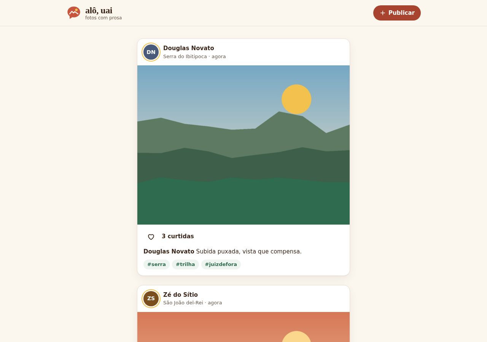
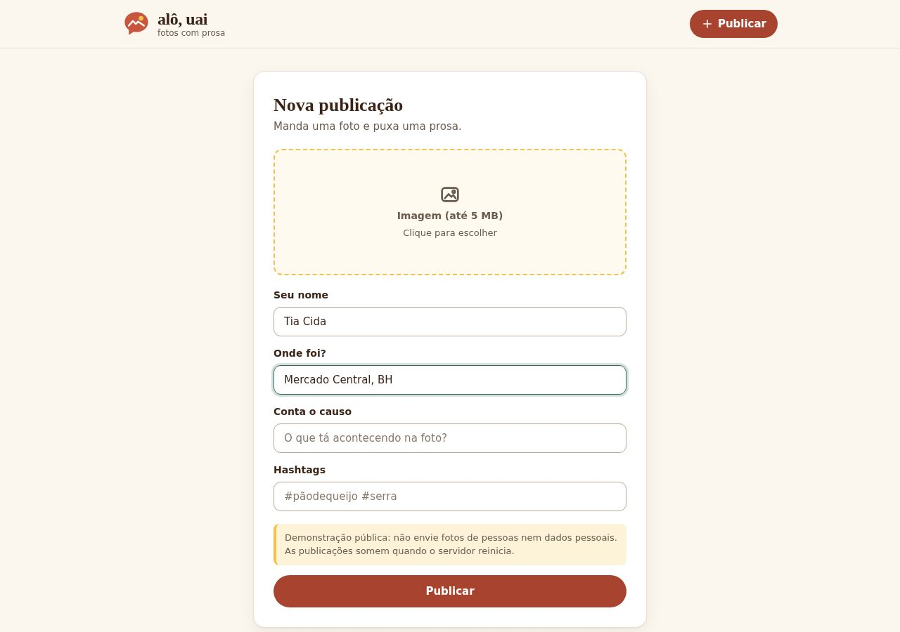
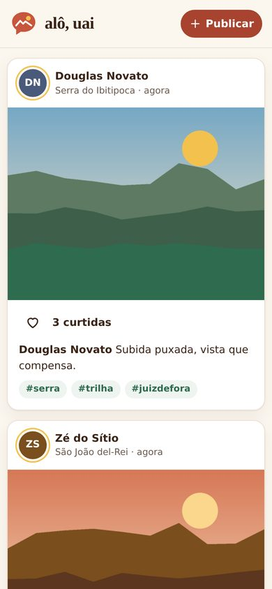

<p align="center">
  
</p>

<h1 align="center">alô, uai</h1>

<p align="center">Feed de fotos com prosa mineira: publique uma foto, conte o causo e veja as curtidas chegarem em tempo real.</p>

<p align="center">
  
</p>

## 🌐 Em produção

- Web: https://alo-uai-web.onrender.com (site estático no Render)
- API: https://alo-uai-api.onrender.com/health (Render Free + MongoDB Atlas M0)
- Passo a passo do deploy: [docs/DEPLOY.md](docs/DEPLOY.md). O app React Native (`instarocket/`, nome técnico da pasta) não é publicado.
- Limites do plano gratuito: a API dorme após 15 min sem acesso (cerca de 1 min para acordar) e as imagens enviadas ficam em disco temporário.
- Demonstração pública: não envie fotos de pessoas nem dados pessoais.

## 💻 Sobre o projeto

O alô, uai é um feed de fotos com identidade própria, inspirado no jeito mineiro de puxar conversa. Nasceu como estudo de um feed social (backend, web e mobile) e foi revisado para servir de demonstração pública.

**O que demonstra**

| Funcionalidade | Como foi feita |
|---|---|
| Publicar foto com nome, local, causo e hashtags | Upload multipart (multer), tipo validado pelo conteúdo, até 5 MB, redimensionamento com sharp |
| Curtidas e novos posts em tempo real | Socket.IO: o feed atualiza sem recarregar, em todas as abas abertas |
| Feed paginado do mais recente | MongoDB com índice em `createdAt` e cursor `before` |
| Identidade visual própria | Paleta creme, café, terracota, milho e serra; símbolo em SVG original; ícones próprios |
| Avatar com iniciais, tempo relativo e hashtags em chips | Funções puras em `frontend/src/lib/format.js`, cobertas por testes |
| Acessibilidade | Contraste AA, foco visível, textos alternativos, `aria-live` nas curtidas, movimento reduzido respeitado |
| Proteção de demonstração | Limite de publicações e curtidas por IP, aviso de "não envie fotos de pessoas" |

- [x] Configuração de ambiente
- [x] Backend (API + tempo real)
- [x] Interface web com identidade própria
- [x] App mobile: congelado (React Native CLI 0.61)
- [x] Hospedagem gratuita: web e API no Render

## 🎨 Layout

<p align="center" style="display: flex; align-items: flex-start; justify-content: center;">
  
  
</p>

**Paleta**

| Token | Cor | Uso |
|---|---|---|
| `--creme` | `#FBF6EE` | Fundo |
| `--cafe` | `#3B2417` | Texto e marca |
| `--terracota` / `--terracota-forte` | `#C8553D` / `#A8432F` | Símbolo / botões (contraste 5,98:1) |
| `--milho` | `#F2C14E` | Destaques e anel do avatar |
| `--serra` | `#2F6B4F` | Hashtags e foco |

## 🚧 Construindo o projeto 

O objetivo é anotar informações que julguei importantes que aconteceram durante a construção do projeto.

#### Ambiente de desenvolvimento

- [x] 1.1. NodeJS - `https://nodejs.org/en/` : versão LTS: v12.18.3 - `node -v`;
- [x] 1.2. package manager - Chocolatey é para o ambiente windows
- [x] 1.3. gerenciador de pacotes 
- [x] 1.3.1. npm : `npm -v`
- [x] 1.3.2. Yarn : `https://yarnpkg.com/` : versão LTS: v1.21.1 - `yarn -v`
- [x] 1.4. Editor : VSCode 
- [x] 1.5. Extensões e Plugins
- [x] 1.5.1. Tema: `dracula`
- [x] 1.5.2. `rocketseat react native`
- [x] 1.5.3. `rocketseat reactjs`
- [x] 1.5.4. `Material icon theme`
- [x] 1.5.5. fonte `fira code`
- [x] 1.6. Sketch cloud - desenhar a aplicação (layout original, substituído pela identidade do alô, uai)

#### Criando a base de dados da aplicação - BACKEND 

- [x] 2.1. Empresas que estão utilizando essa tecnologia React, React Native, Nodejs: NetFlix, Trello, PayPal, Linkedin, Uber, NASA, Medium
- [x] 2.2. backend da aplicação utilizando nodejs
- [x] 2.3. api rest: serviços que não possuem funcionalidades de view
- [x] 2.4. nova pasta : backend - `yarn init -y` : cria arquivo `package.json` : guarda os registros das dependências do nosso projeto
- [x] 2.5. instalar dependência Express : `yarn add express`
- [x] 2.5.1. `yarn.lock`: arquivo de logs
- [x] 2.5.2. scripts : dev : `node src/index.js` >> `http://localhost:3333/` : PORTA DO backend
- [x] 2.5.3. Nodemon : `yarn add nodemon -D` - script dev no package.json - `yarn dev` : atualiza o servidor a cada mudança - `scripts : dev : nodemon src/index.js`
- [x] 2.5.4. rodar a aplicação: `yarn dev` ou `npm run dev`
- [x] 2.6.1. MongoDB Atlas - bd não relacional online: `https://www.mongodb.com/cloud/atlas`
- [x] 2.6.2. criar um cluster >> connect >> Your Application >> copy na string de acesso
- [x] 2.6.3. criar db access >> alterar informações na string de acesso
- [x] 2.6.4. criar network access >> add ip address
- [x] 2.7. mongoose : `yarn add mongoose`
- [x] 2.7.1. mongoose.connect no index.js
- [x] 2.8. Api Rest
- [x] 2.8.1. arquivo `routes.js`
- [x] 2.8.2. criar pastas : src : models, controllers, config
- [x] 2.9. Models
- [x] 2.9.1. Post.js
- [x] 2.10. Config
- [x] 2.10.1. upload.js
- [x] 2.11. Controllers 
- [x] 2.11.1. LikeController.js
- [x] 2.11.2. PostController.js
- [x] 2.12. Insomnia : Instalar e criar uma workspace
- [x] 2.13. Multer : `yarn add multer`
- [x] 2.13.1. path : biblioteca que formata caminho de arquivos
- [x] 2.13.2. upload de imagens no diretório do projeto - multer.diskStorage
- [x] 2.13.3. upload de imagem na base de dados
- [x] 2.13.4. listando os posts na api rest
- [x] 2.13.5. dar like : `http://localhost:3333/posts/5d03fa4f261c3d2928c817bb/like`
- [x] 2.13.6. redimensionar imagens: dimensões menores, qualidade menores.
- [x] 2.13.7. instalar sharp: manipular imagens dentro da aplicação - `yarn add sharp`
- [x] 2.13.8. insomnia - post >> create >> `http://localhost:3333/posts`
- [x] 2.13.9. deletar a imagem original : `fs.unlinkSync`
- [x] 2.13.10. path : endereço da imagem : `http://localhost:3333/files/OmniStack.png`
- [x] 2.13.11. transformando png em jpg - `http://localhost:3333/files/OmniStack.jpg`
- [x] 2.14. cors : `yarn add cors` : permitir acessibilidade mesmo em domínios diferentes
- [x] 2.15. real time : biblioteca **socket.io**  : `yarn add socket.io`
- [x] 2.15.1. `socket.io` : server = http e io demais : possibilitam acessar a aplicação de diferentes protocolos, ou seja, que nosso backend seja visualizado pelo frontend.
- [x] 2.16. Revisão:
- [x] 2.16.1. `index.js`:entrada da nossa aplicação- importação das dependências, conexão com banco de dados, divisão do servidor para http e socket.io, o cors permitindo acesso por todos protocolos, rotas para arquivos físicos e estáticos
- [x] 2.16.2. `routes.js`: rotas get e post, rotas para realizar likes
- [x] 2.16.3. controllers: LikeController e PostController fazendo nossa regra de negócios.
- [x] 2.16.4. Model Post: uma representação da tabela no banco de dados.
- [x] 2.16.5. config `upload.js` : determinado o local para armazenar os arquvios de upload
- [x] 2.16.6. libs express mongo multer sharp 

#### Construindo a interface web - FRONTEND web

- [x] 3.1. rodar a aplicação backend: `yarn dev` em `http://localhost:3333/`
- [x] 3.1.1. criando a aplicação em reactjs: `npx create-react-app frontend`
- [x] 3.1.2. rodar a aplicação frontend: `yarn start` em `http://localhost:3000/`
- [x] 3.2. Adicionar rotas com Router: `yarn add react-router-dom` 
- [x] 3.3. Biblioteca axios: `yarn add axios`, para tratar requisições
- [x] 3.4. Pontos importantes desse projeto
- [x] 3.4.1. componentes em formato de função
- [x] 3.4.2. componentes em formato de classe
- [x] 3.5. Link é o componente react que funciona como o `<a>` do html mais poderoso
- [x] 3.6. warning: a api que criamos não está retornando as imagens no post
- [x] 3.7. tratando o formulário de um novo posto em `New.js`
- [x] 3.8. like
- [x] 3.9. real time : socket.io : `yarn add socket.io-client`
- [x] revisado o funcionamento do frontend web
- [x] gerar favicon personalizado

#### Desenvolvendo o app - FRONTEND mobile 

- [x] Para configurarmos o ambiente de desenvolvimento, seguir orientações conforme detalhes no link `https://docs.rocketseat.dev/ambiente-react-native/android/windows` 
- [x] Chocolatey
- [x] Node, Python2 e a JDK8
- [x] CLI (Command Line Interface) do React Native
- [x] SDK do android
- [x] genymotion + virtualbox
- [x] criar o projeto mobile : `react-native init instarocket`
- [x] rodar a aplicação com o emulador aberto : `react-native run-android`
- [x] nas próximas vezes : `react-native start`
- [x] biblioteca para navegação: `yarn add reat-navigation react-native-gesture-handler`
- [x] link nativo: `react-native link react-native-gesture-handler`
- [x] arquivo `routes.js`
- [x] Navegação New e Feed
- [x] estilização do front New e Feed
- [x] socket.io-client - realtime: `yarn add socket.io-client`
- [x] criar novo post
- [x] camera e galeria de fotos: `yarn add react-native-image-picker`
- [x] link nativo: `react-native link react-native-image-picker`
- [x] ir ao docs de permissão e copiar e colar trecho de ios e android.

#### Funcionalidades Avançadas

- backend: yarn add eslint -D
- frontend web: yarn add styled-components
- frontend web: react-hooks escrever componentes em formato de funções
- bd: trocar mongodb, um banco não relacional, para um banco relacional, como o sql com sequelize.
- dribbble e sketch: inspirações templates de layout
- recriar layout
- typescript
- redux e contextAPI
- graphGH
- permitir escalabilidade 
- testes automatizados
- fluxo de deploy manual e automatizar
- capturar erros em desenvolvimento e em produção

## 🛠 Tecnologias

As seguintes ferramentas foram usadas na construção do projeto:

- [Css][css]: posicionamento, dimensionamento e muito mais
- [Javascript][javascript]
- [HTML][html]: estrutura e efeitos 
- [React][reactjs]: os fundamentos, como state, props, components, ciclo de vida.
- [Git][git]
- [Github][github] 
- [Yarn][yarn]
- [Node.js][nodejs]
- [React Native][reactnative]
- [Render](https://render.com/) + [MongoDB Atlas](https://www.mongodb.com/atlas) (hospedagem gratuita atual; a versão original usava o Zeit Now)

## 🚀 Como executar o projeto

Partes: **backend** (API + tempo real), **frontend** (web) e **instarocket** (app React Native, congelado; o nome da pasta ficou por estar amarrado ao projeto nativo).

```bash
# Backend (http://localhost:3333) — MongoDB local (mongod) ou Atlas M0
cd backend && cp .env.example .env   # preencha MONGODB_URI
npm install && npm run dev
npm test

# Frontend web (http://localhost:5173)
cd frontend && cp .env.example .env
npm install && npm run dev
npm test
```

App: ajuste o endereço em `instarocket/src/config.js` e rode `npx react-native run-android` (não validado nesta revisão).

### Versão 2.0 (revisão de qualidade)

- [x] Senha do MongoDB removida do código (`.env`)
- [x] Upload seguro: tipo validado pelo conteúdo, até 5 MB, nome aleatório, rotação corrigida
- [x] Feed ordenado do mais recente (o campo `createAt` não existia) e paginado
- [x] Curtida atômica; post inexistente não derruba a API
- [x] Web em Vite 8 + React 18 com estados de carregando, vazio e erro; acessível (WCAG AA)
- [x] App: corrigidos os bugs de JS (feed apagado a cada curtida, campos que gravavam sempre o autor, API antiga do image-picker)
- [x] Testes automatizados na API e no web

### Versão 2.1 (identidade própria)

- [x] Novo nome e marca: **alô, uai** (a versão anterior imitava o nome e o logo de uma rede social)
- [x] Símbolo, favicon e ícones próprios em SVG; paleta e tipografia novas
- [x] Avatar com iniciais, tempo relativo, hashtags em chips e animação de curtida
- [x] Aviso de demonstração pública no rodapé e no formulário

Detalhes em [docs/ANALISE.md](docs/ANALISE.md), [docs/ARQUITETURA.md](docs/ARQUITETURA.md) e [docs/PLANO-DE-ACAO.md](docs/PLANO-DE-ACAO.md).

## 📝 Licença

Este projeto está sob a licença MIT.

---

Feito com ❤️ por Douglas A B Novato 👋🏽 [Entre em contato!](https://www.linkedin.com/in/douglasabnovato/)

[git]: https://git-scm.com/doc
[github]: https://docs.github.com/en
[nodejs]: https://nodejs.org/
[typescript]: https://www.typescriptlang.org/
[expo]: https://expo.io/
[reactjs]: https://reactjs.org
[rn]: https://facebook.github.io/react-native/
[yarn]: https://yarnpkg.com/
[vscode]: https://code.visualstudio.com/
[vceditconfig]: https://marketplace.visualstudio.com/items?itemName=EditorConfig.EditorConfig
[license]: https://opensource.org/licenses/MIT
[vceslint]: https://marketplace.visualstudio.com/items?itemName=dbaeumer.vscode-eslint
[prettier]: https://marketplace.visualstudio.com/items?itemName=esbenp.prettier-vscode
[rs]: https://rocketseat.com.br 
[css]: https://developer.mozilla.org/en-US/docs/Web/CSS 
[html]: https://developer.mozilla.org/en-US/docs/Web/HTML
[javascript]: https://developer.mozilla.org/en-US/docs/Web/JavaScript 
[reactnative]: https://reactnative.dev/

Origem: projeto de estudo de feed de fotos da Semana Omnistack 7 ([Rocketseat](https://www.rocketseat.com.br/)), reescrito com identidade própria.
