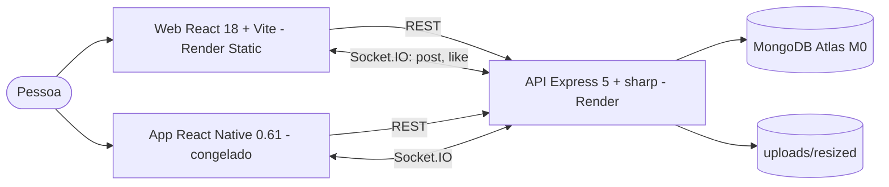

# Arquitetura — alô, uai (antigo instagram-feed)

## 1. C4

## 2. Contrato

| Método | Rota | Resposta |
|---|---|---|
| GET | /posts?before=&limit= | posts do mais recente, com `image_url` |
| POST | /posts (multipart `image`) | 201 post; 400 com `errors[]` |
| POST | /posts/:id/like | post atualizado; 404 |
| GET | /files/:nome | JPEG (cache 30 dias) |

Eventos Socket.IO: `post` e `like` para todos (feed público).

## 3. ADRs

| # | Decisão | Motivo | Alternativa |
|---|---|---|---|
| ADR-01 | Validar a imagem pelo conteúdo (sharp) e gravar só o JPEG gerado | O content-type do cliente não é confiável; nada do arquivo original fica em disco | Filtro por mimetype |
| ADR-02 | Paginação por cursor (`before`) | Estável com novos posts chegando em tempo real | page/offset |
| ADR-03 | Publicação sem login, com limite por IP | Mantém o produto original | Login — **decisão sua** |
| ADR-04 | App mantido em RN CLI 0.61, só correções de JS | Readme do autor pede para não evoluir o app | Migrar para Expo — **decisão sua** |
| ADR-05 | Disco para imagens | Simples; no Render Free é apagado a cada deploy | Cloudinary gratuito — **decisão sua** |
